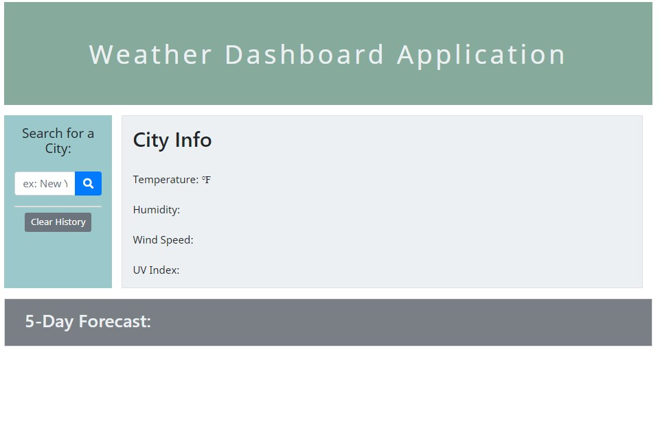

# Weather Dashboard

## Description
A weather dashboard that allows the user to view the current and 5 day forecasts for searched cities.  

## Technology Used
This application is built with HTML, CSS, Bootstrap, Javascript, JQuery, and Third Party API's

## Links
https://github.com/chloeyu17/weather/

https://chloeyu17.github.io/weather/

## Usage
The weather app displays current weather and 5 day forecast including temperature, humidity, wind speed, and UV index
The user can clear recent searches or view recent searches

